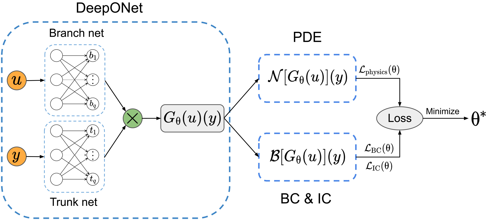

# Separable Self-Adaptives PI-DeepONets
- M. Beekenkamp, A. Bhagavathula, P. LaDuca.

## Introduction
This project combines several techniques found in Physics Informed Neural Networks (PINNs) research and implements them into a PI-DeepONet, to reduce error and computational costs. Specifically, we are using Separable Physics Informed Neural Networks (SPINNs), and Self-Adaptive Physics Informed Neural Networks (SAPINNs) to achieve these gains.   

Separable Physics Informed Neural Networks (SPINNs), originally proposed in the paper “Separable PINN: Mitigating the Curse of Dimensionality in Physics-Informed Neural Networks.” by Cho et al. are an architectural overhaul of conventional PINNs that can approximate solutions to partial differential equations (PDEs). These architectural changes allow us to leverage forward-mode autodifferentiation (AD) and operate on a per-axis basis. Compared to conventional PINNs, which use point-wise processing, SPINNs presents a notable reduction in training time whilst maintaining accuracy.  

Self-Adaptive PINNs (SA-PINNs), as proposed in the paper “Self-Adaptive Physics-Informed Neural Networks using a Soft Attention Mechanism” by McClenny, and Braga-Neto extend on the work of a simple PINN by adding a self-adaptive element which optimally regularises the components of the implemented loss function. Notably, SA-PINNs automate a process which hitherto was done by trial and error, or from information on the optimal solution known before training. The addition of the self-adaptive component further improves on the strengths of PINNs, the decreased training time, data requirements, and encoded physical laws.    

The key idea behind DeepONets is to consider the input and output of a deep neural network as elements of infinite-dimensional Banach spaces. The neural network learns to approximate the unknown operator mapping from one Banach space to another. This operator can represent complex functions or physical laws, making DeepONets particularly effective for PDE problems.    

DeepONets can learn to represent complex relationships and nonlinearities within the operator by utilising the expressive power of deep neural networks. By training on data that represents the behavior of the operator, the network can learn the underlying patterns and generalise to unseen inputs. This allows DeepONets to provide accurate predictions and solutions for problems with continuous and infinite-dimensional characteristics.    

The structure shown in the image above, coming from Junwoo Cho's paper, demonstrates the double network architecture of a PI-DeepONet (or DeepONet). Noting that DeepONets classicaly require big data sets to train on, and that the computational costs of these networks are high, it follows that reductions in computational complexity would have a drastic time saving effect.  

## Motivating Literature and Sources
Wang, Sifan, et al. ["Learning the Solution Operator of Parametric Partial Differential Equations with Physics-Informed Deeponets."](https://doi.org/10.1126/sciadv.abi8605) Science Advances, vol. 7, no. 40, 2021. 

Levi D. McClenny, & Ulisses M. Braga-Neto (2020). ["Self-Adaptive Physics-Informed Neural Networks using a Soft Attention Mechanism."](https://arxiv.org/abs/2009.04544) CoRR, abs/2009.04544.

Cho, Junwoo, et al. ["Separable PINN: Mitigating the Curse of Dimensionality in Physics-Informed Neural Networks."](https://arxiv.org/abs/2211.08761) arXiv preprint arXiv:2211.08761 (2022).